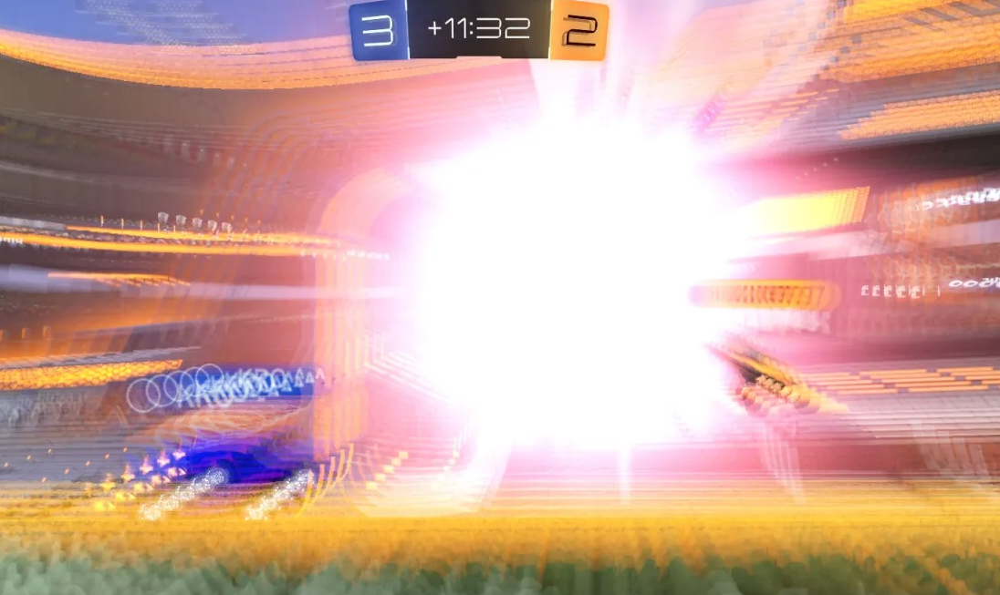

# Spaceship Conference — BKCTF 2026

**Flag:** `bkctf{34.104,-117.876}`

## Overview

It's like soccer, but with cars!

Find the location that this game was played.
Use coordinates, rounded to 3 decimal points.

If one is unfamiliar with the game in the image, it is Rocket League, a popular game where cars play soccer (or football) against one another.

Looking closely, you can see we are trying to find a game that ended 3-2, 11:32 into overtime, and we can make out the player's name on the left as 'Kro^-^', with another google search, we can see this is the nickname for the pro player *Kronovi^-^*.

Well, how can we find specific Rocket League replays?

With a quick google search, we can find the website [ballchasing.com](https://ballchasing.com), a public replay storage system!

Using this website, it is possible to filter games to fit a specific criteria.

Searching by the player 'Kronovi^-^', and knowing the fact that it is a local game (as we need to find a location), and knowing there is a pro player in the lobby, we narrow down to... 356 results. Yikes

While it is possible to search through this games using ctrl+f in order to find games that had 11:32 minute overtimes, there is another option available.

Familiar players may be able to recognize the map being played on as *Champion's Field (Day)*, and narrowing results down to this map leaves us with **11** replays!

This leads us to the replay ***G6 All Star Match***, which lasted 11:32 minutes into overtime!

Clicking on the replay uploaded by *Evhon* will show that it is a part of a *replay group* for *Rocket League Summit 1*.

A quick lookup of this event will show this was an event hosted by ***Beyond the Summit***, a popular tournament organizer!

**=================================NOTE=================================**

Some competitors also found that you can find the game (and the tournament it is from) using the public Discord Rocket League API that can be found in the Rocket League Discord server. thanks Discord -_-

**=================================NOTE=================================**

During 2019, when the tournament took place, Beyond the Summit hosted their tournaments in their Los Angeles facility.

A quick lookup of *Beyond the Summit LLC* will get you this address!

***759 Arrow Grand Circle, Covina, CA 91722, United States***

Last thing needed is to go into google maps and get the coordinates for this place!

Flag: `bkctf{34.104,-117.876}`